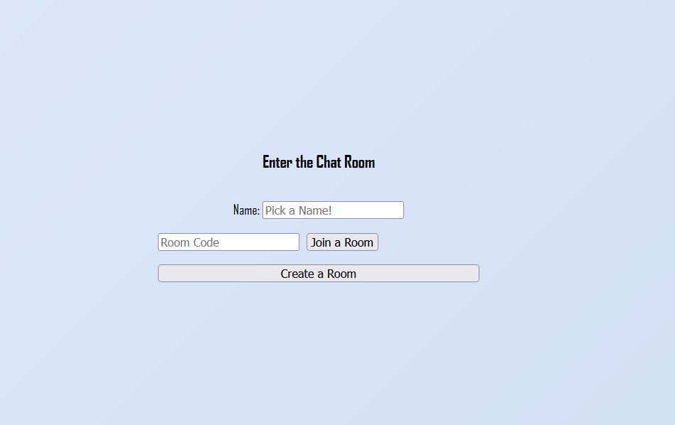

## Project Report: Real-Time Chat App using Flask & [Socket.IO]

### Introduction

This is a real-time chat application built with Flask and Flask-SocketIO. It allows users to create or join temporary chat rooms using unique codes and exchange live messages. The app uses in-memory storage, so rooms and messages are temporary.

### Technologies Used

Flask-SocketIO – Enables WebSocket-based real-time messaging

HTML/CSS + JS – Frontend with [Socket.IO]client integration

Jinja2 – Templating for dynamic page rendering

### App Workflow

**Home Page (/):**

User enters a name.

Can join a room (via room code) or create a new one.

A 4-letter room code is generated for new rooms.

Chat Room (/room):

Displays current messages and live chat interface.

Messages are exchanged using WebSockets.

**WebSocket Events**
connect: Joins room, announces entry

message: Broadcasts and stores messages

disconnect: Announces exit, deletes room if empty

**Session & Storage**
Flask session stores user info (name + room).

Rooms and messages are stored in a Python dictionary (rooms).

Data is lost on server restart (no database).

**Key Features**
Real-time messaging

Temporary unique chat rooms

Simple UI with message history

[Socket.IO](http://socket.io/) for WebSocket communication

**TCP Usage**
The app does use TCP, because:

Flask routes use HTTP over TCP

WebSocket connections (via [Socket.IO](http://socket.io/)) also run over TCP

### Conclusion

This project shows how to create a simple, real-time group chat using Flask and [Socket.IO](http://socket.io/). It handles user sessions, room management, and live communication — all over TCP.